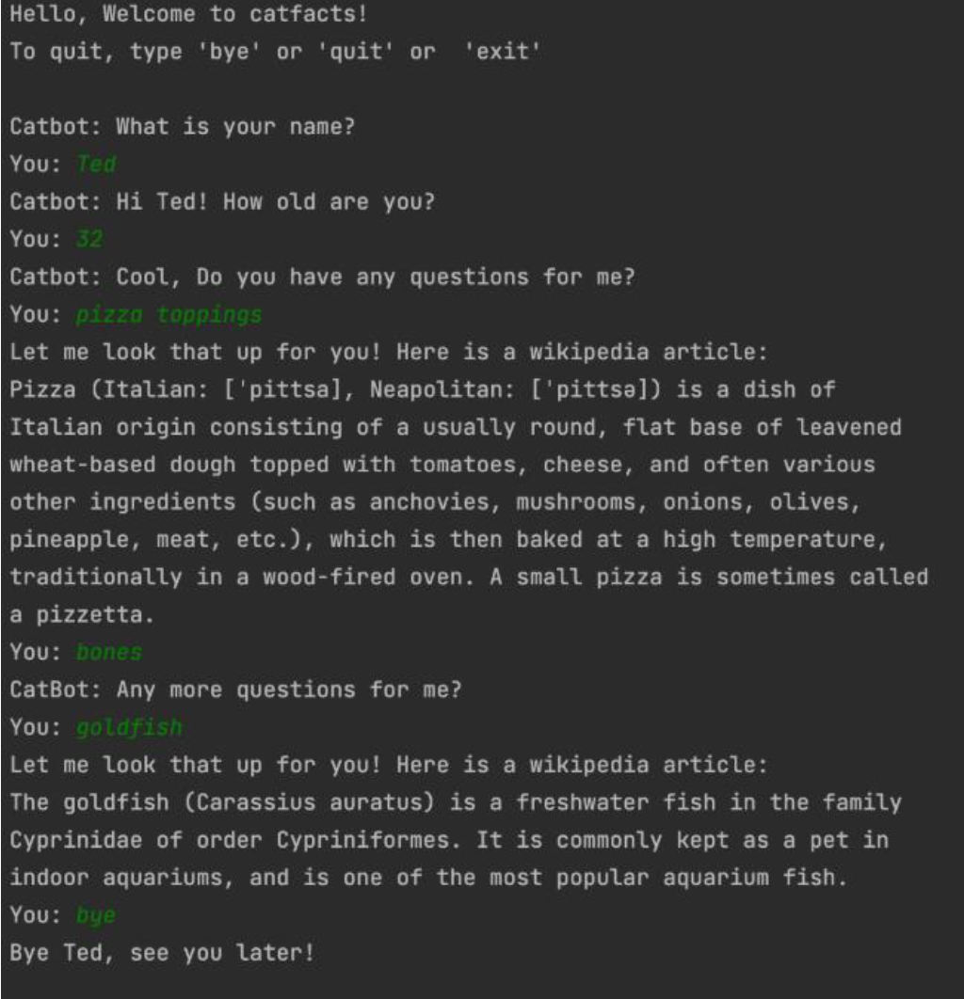
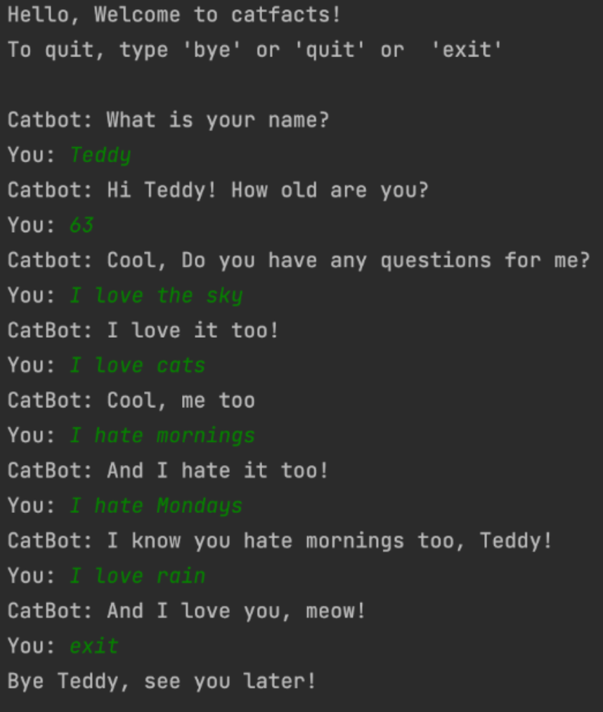

# Catbot
CatBot is a rules based chatbot built from scratch that gives user facts and jokes about cats from a knowledge base. It uses NLP techniques such as cosine similarity, user input parsing, information retrieval, etc. The chatbot also maintains a user model of the user's name, age, likes, and dislikes based on previous conversations. 

# Installation
Easy installation, just clone the project and download the necessary libraries/dependencies for python

# Usage
Run the chatbot, enter your name and age to interact with the chatbot

Sample Dialogues/questions:
- How old are you
- Who are you
- Who made you
- Tell me a joke
- Tell me a cat fact
- I like/love {something}
- I hate/dislike {something}

# Sample Runs

